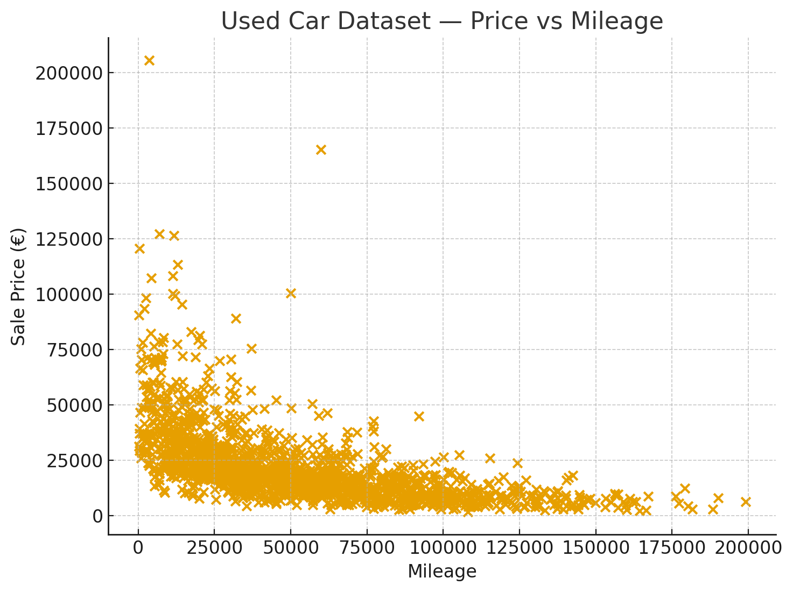

# Used Car Price Analysis

This project analyses a dataset of used Audi cars from the Irish market to understand how different factors—such as mileage, model, and year—affect the sale price. The aim is to explore market trends, clean the data, visualise important relationships, and prepare the dataset for predictive modelling.

---

## 📌 Key Highlights

- **Dataset**: Real scraped Audi used-car listings from Ireland  
- **Focus Areas**:
  - Price distribution  
  - Relationship between mileage and price  
  - Trends across models and years  
- **Techniques Used**:
  - Data cleaning  
  - Exploratory Data Analysis (EDA)  
  - Visualisation using scatter plots and charts  

---

## 📊 Price vs Mileage (Scatter Plot)

---

<p align="center">
  
</p>

This scatterplot shows the expected trend:  
**higher mileage → lower price**, with premium Audi models forming visible high-price clusters.

---

## 📂 Project Structure

```
/data
  cars_dataset.json
  cars_clean.json
/notebooks
  Notebook1_23341901.ipynb
  Notebook2_23341901.ipynb
/src
  (data cleaning, scraping, and modelling scripts)
README.md
```

---

## 🚀 How to Run

1. Clone the repository:

git clone https://github.com/Zhang-Charlie/used-car-price-analysis
cd used-car-price-analysis

2. Open the Jupyter notebooks in the **/notebooks** folder to view:  
   - Data scraping  
   - Cleaning  
   - Analysis  
   - Visualisation

3. Modify the analysis or run it on your own dataset.

---

## 📘 What I Learned

Throughout this project, I gained experience with:

- **Web scraping and JSON dataset handling**  
- **Cleaning real-world messy data** (missing values, inconsistent formats)  
- **Exploratory Data Analysis (EDA)** techniques  
- **Visualising relationships** such as mileage vs price  
- **Interpreting real automotive market trends**  
- Structuring analysis using **Jupyter Notebooks**  
- Preparing data for **machine learning price prediction**

This project strengthened my data analysis workflow and helped me understand how real-world numerical datasets behave.
